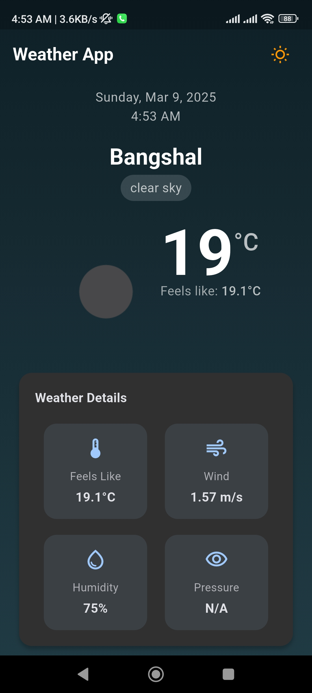
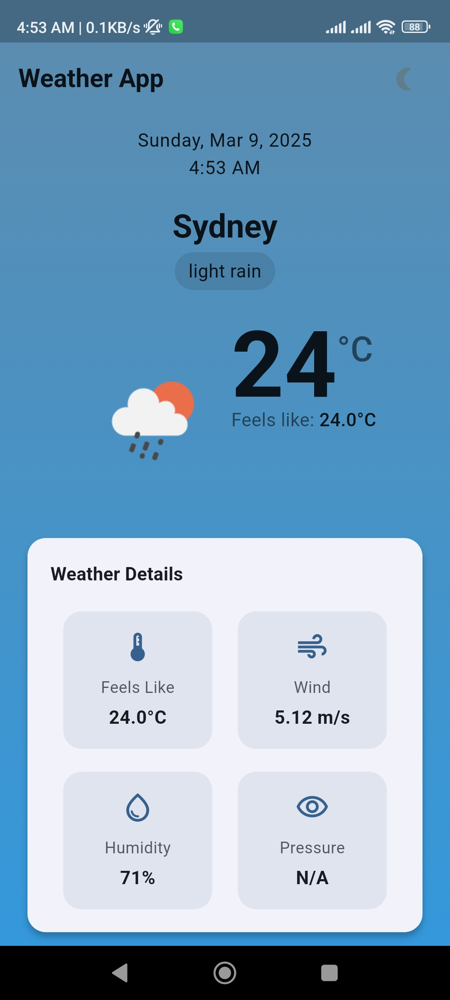
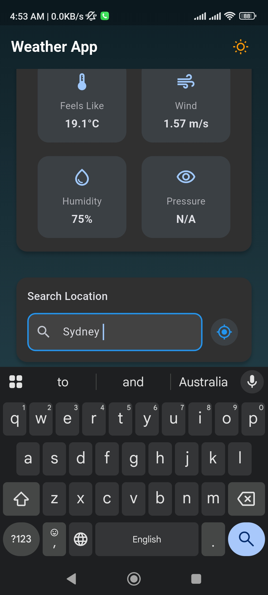

# weather_app

Weather App using Flutter that fetches real-time weather data via an API. The app includes geolocation support, providing users with personalized weather updates based on their location.

## Screenshots

  
  
  

